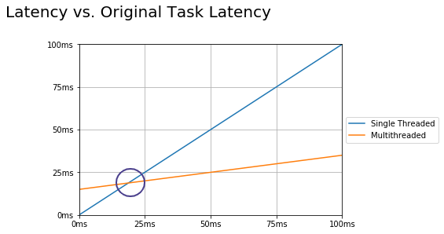

# Optimizacion de redimiento

Ejemplos de aplicaciones donde el rendimiento es importante:   

1. High speed trading system  
    El rendimiento usalmente se mide a traves de la latencia, que es
    el tiempo que toma a una transaccion ser completada
2. Video player  
    Queremos enviar el contenido al usuario a la velocidad adecuada, asi que
   aqui medimos la precision y el framerate  
3. Machine learning  
    Estas aplicaciones tienen mejor rendimiento a mayor cantidad de datos pueden ingestar
   asi que el rendimientos e mide a traves del throughput
   

Hablaremos de rendimiento en aplicaciones multihilo a traves de la latencia
y el throughput.

## Latencia
Tiempo para completar una tarea medido en unidades de tiempo 

Una forma de disminuir la latencia podria ser:
1. Separar una tarea en partes mas pequenas
2. Ejecutar cada una de esas sub tareas de forma paralela
3. La latencia sera T(Latencia original)/N(Subtasks) -> Reduccion teorica de la latencia

Pero, cuantas subtareas podemos crear? Idealmente seran el mismo numero de nucleos que tiene
una computadora de proposito general. La tareas solo se ejecutan realmente en paralelo
si cada una de ellas se ejecuta en un nucleo distinto

Si se agrega un hilo mas, puede resultar contraproducente debido a que el context switching
va a estar moviendo los hilos

> Usar el mismo numero de hilos que de nucleos solo es optimo si todos los hilos son ejecutables y pueden correr sin interrupciones 
> (No IO/ blocking/ sleep/ etc)

Nada mas debe de ejecutarse que consuma mucho CPU

### Hyperthreading
Un nucleo fisico puede tener varios hilos a la vez a traves de hardware, es algo 
casi cercano a correr los procesos completamente en paralelo pero no exactamente lo mismo

### Costos inherentes de paralelizacion y agregacion
1. Romper la tarea en subtareas   
2. Creacion de hilos, pasar tareas a hilos  
3. Tiempo entre thread.start() hasta que el hilo se programe  
4. Tiempo hasta que el hilo finalice y avise  
5. Tiempo hasta que el hilo de agregacion se ejecute  
6. Agregacion de subresultados en un solo artefacto  



> No se puede descomponer cualquier tarea en subtareas

## Throughput
Cantidad de tareas que se pueden completar en cierto periodo de tiempo, medido en tareas/
unidad de tiempo

Esta medida es importante cuando se tienen sistemas que reciben tareas concurrentes y queremos ejecutar la mayor cantidad
posible de ellas a la vez (tan rapido como sea posible)  
Aproximaciones:  
1. Descomponer tareas en subtareas
2. Ejecutar tareas en paralelo

##Thread pooling
Tecnica que permite crear un pool de hilos y reusarlos en tareas futuras.
Las tareas son almacenadas en una queue y son despachados por algun
hilo disponible en el thread pool. Si todos los hilos estan ocupados, las tareas
se mantendran en la cola y esperaran a que un hilo este disponible
> No es trivial implementar un thread pool, JDK proporciona algunas implementaciones de thread pools (Thread Pool Executor)   

```java
int numberOfThreads = 3;
Executor executor = Executors.newFIxedThreadPool(numberOfThreads);

Runnable task = ...;
executor.execute(task);
```

1. Al ejecutar cada tarea en paralelo en un hilo separado, podemos implementar la ejecucion en un factor de N
2. N = # hilos = # nucleos
3. Usando un *Fixed Thread Pool* mantenemos un numero constante de hilos, eliminando la necesidad de recrear hilos

# Example for image processing algorithm - Latency optimization
> Check the ImageProcessing class

# Example for concurrent http server - Throughput optimization
Ejecutaremos un servidor que actuyara como una especie de buscador.
Utilizando el libro *War and Peace* de Tolstoi, el servidor recibira una palabra y retornara cuantas veces aparece dicha palabra en el libro

